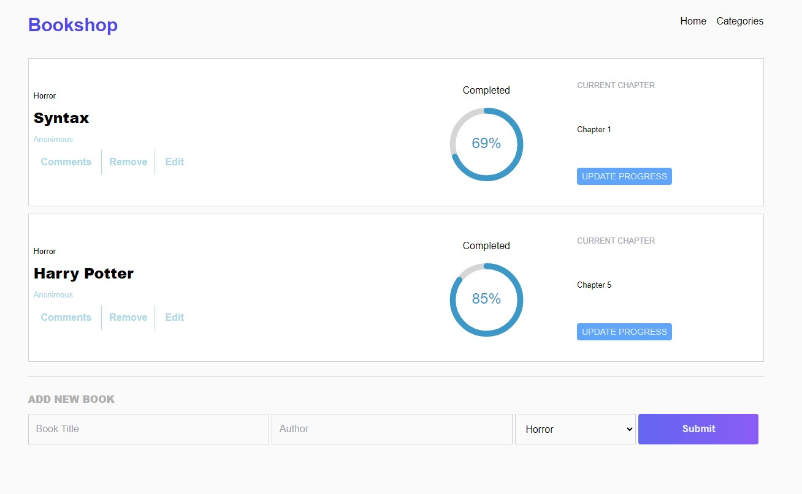

# Bookstore

>Bookstore React App

## Built With

- HTML, CSS and JavaScript
- React & Redux

## Live Demo

- [Live Demo Link]() Pending

## Getting Started

To get a local copy up and running follow these simple example steps.

### You need NPM installed in your comnputer

### First clone the repo

`git clone https://github.com/Lino09/bookstore.git`

### Then Run the following commands

> `cd bookstore`  
> `npm install`   
> `npm start`  

### It will run in your http://localhost:3000/

## Author

👤 **Abel Herrera**

- GitHub: [@Lino09](https://github.com/Lino09)
- Twitter: [@AbelHerreaZam1](https://twitter.com/AbelHerreaZam1)

## 🤝 Contributing

Contributions, issues, and feature requests are welcome!

Feel free to check the [issues page](../../issues/).

## Show your support

Give a ⭐️ if you like this project!

## Acknowledgments

- Microverse

## 📝 License

This project is Free to use